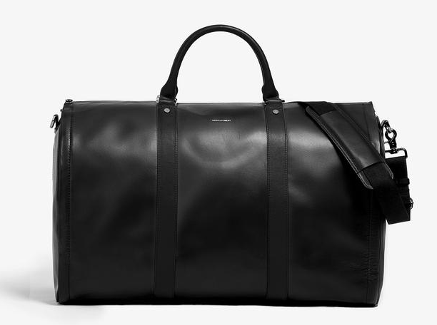

  I have tried and tested a few gadgets and clothing that I absolutely need to have with me while traveling. This is my gear, this is my equipment, this is what I upgraded to +10 and to have the perfect stats
  
My Motto is buy nice or buy twice. I have found that aiming for quality and buying things that would last me a lifetime is a more frugal strategy over the long term and better for the environment/less waste.

   
<ul>
  <li class="gear_header"> Bags </li>

  <li class="gear_li"><a href="https://www.coteetciel.com/en_us/isar-backpack-black-medium-laptop-bag">Cote et Ciel Isar</a></li>
  
  
Amazing backpack with style and utility. Perfectly stores my laptop, anti theft compartment for important things. Secret compartment on the side. Front is a duffel that fits a whole bunch of things. Waterproof. This backpack is what I consider to be life-lasting

  <li class="gear_li"><a href="https://www.hookandalbert.com/products/mens-project-11-garment-weekender-black-black">Hook and Albert Weekender</a><li>
  
  
The perfect carry-on bag. Because it is more compact than rollies, you will never get stopped to ask to have this checked in. It also survives the check in as well. Fits quite a bit and collapses for storage. It has a pretty well working hangar compartment for pants/shirts. Shoes compartments on the sides too. I love this bag

  <li class="gear_header">Clothes</li>

  <li class="gear_li"><a href="https://ministryofsupply.com/">Ministry of Supply</a> </li>
  
Shirts are comfortable breathable, light on the maintenance and durable. Form fitting and stretchy for <strong>those</strong> days. I like the <a href="https://ministryofsupply.com/products/hybrid-button-down-light-blue-gingham">Hybrid Dress Shirts</a>. The shirts are pretty high tech too! 

  <li class="gear_li"><a href="https://outlier.nyc/">Outlier NYC</a><li>
  
The shirts are pretty good here but they need to be ironed, but otherwise they are great for heavier climates and durability. The light shortsleeve shirts are great here too. I really like the <a href="https://shop.outlier.nyc/shop/retail/slim-dungarees.html">Slim Dungarees</a> for my go to Pants. These are very durable, high tech and form-fitting. I have not found slim pants that feel and fit this great. I have not worn jeans in years because of these. These are waterproof and you can even put out a cigarette on them without any damage. Very tough.

  <li class="gear_header">Shoes</li>

  <li class="gear_li"><a href="https://wolfandshepherd.com">Wolf and Shepherd</a><li>  
  
 I really like the <a href="https://wolfandshepherd.com/collections/best-sellers-1/products/senna-wingtip?variant=6269869850663">Sienna Wingtips</a> and the <a href="https://wolfandshepherd.com/collections/boots/products/breakaway-boot?variant=6270714478631">Onyx Breakaway boots</a>. These actually feel like sneakers and the quality is very high.

  <li class="gear_li"><a href="https://www.adidas.com/us/ultraboost?cm_mmc=AdieSEM_Google-_-boost-Shoes-B-Exact-2B-_-UB_General-adidas-default-exact-_-43700035847623441&cm_mmca1=US&cm_mmca2=&ds_agid=58700004302066472&gclid=EAIaIQobChMI_-Kt34uq3wIV2FqGCh1ZDAMuEAAYASAAEgI8dPD_BwE&gclsrc=aw.ds">Addidas Ultraboosts</a><li>
  
 I used to be a sneakerhead and have a pretty solid collection but it all ended once I tried on the Ultraboosts. There's really no sneaker as comfortable as these. 
  
 Not a fan of the new 19s, I rock the 3.0 and 4.0's in Triple Black.

  <li class="gear_header">Electronics</li>

  <li class="gear_li">Google Pixel 2 XL<li>
  <li class="gear_li">Google Pixel Buds</li>
  <li class="gear_li">Bang and Olufsen h8's</li>
  <li class="gear_li">Nintendo Switch</li>
  <li class="gear_li">Apple Macbook</li>
  <li class="gear_li"><a href="https://www.amazon.com/myCharge-Portable-Integrated-Lightning-Micro-USB/dp/B01K2UP6JW/ref=sr_1_1_sspa?ie=UTF8&qid=1545160831&sr=8-1-spons&keywords=mycharge+usb+c&psc=1">MyCharge USB C portable charger</a></li>
  
Charges all my devices. This thing is simply amazing with the plugs already connected

<ul>

