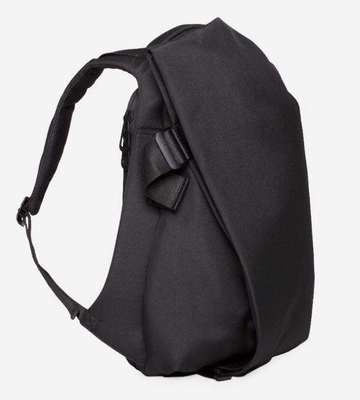

  I have tried and tested a few gadgets and clothing that I absolutely need to have with me while traveling. This is my gear, this is my equipment, this is what I upgraded to +10 and to have the perfect stats
  
My Motto is buy nice or buy twice. I have found that aiming for quality and buying things that would last me a lifetime is a more frugal strategy over the long term and better for the environment/less waste.
   
  

<iframe style="width:120px;height:240px;" marginwidth="0" marginheight="0" scrolling="no" frameborder="0" src="//ws-na.amazon-adsystem.com/widgets/q?ServiceVersion=20070822&OneJS=1&Operation=GetAdHtml&MarketPlace=US&source=ac&ref=tf_til&ad_type=product_link&tracking_id=anhsolo-20&marketplace=amazon&region=US&placement=B079X5FTZR&asins=B079X5FTZR&linkId=b55a5902342d952bdcd9568529a543f2&show_border=false&link_opens_in_new_window=true&price_color=333333&title_color=0066c0&bg_color=ffffff">
</iframe>

   
<ul>
  <li class="gear_header"> Bags </li>

  <li class="gear_li"><a target="_blank" href="https://www.amazon.com/gp/product/B007A7BJ92/ref=as_li_tl?ie=UTF8&camp=1789&creative=9325&creativeASIN=B007A7BJ92&linkCode=as2&tag=anhsolo-20&linkId=acc650cefea300b2c955f4f31181b759">Cote &amp; Ciel Isar</a></li>
  

  
Amazing backpack with style and utility. Perfectly stores my laptop, anti theft compartment for important things. Secret compartment on the side. Front is a duffel that fits a whole bunch of things. Waterproof. This backpack is what I consider to be life-lasting

  <li class="gear_li"><a href="https://www.hookandalbert.com/products/mens-project-11-garment-weekender-black-black">Hook and Albert Weekender</a><li>
  

  
The perfect carry-on bag. Because it is more compact than rollies, you will never get stopped to ask to have this checked in. It also survives the check in as well. Fits quite a bit and collapses for storage. It has a pretty well working hangar compartment for pants/shirts. Shoes compartments on the sides too. I love this bag

  
<a target="_blank" href="https://www.amazon.com/stores/node/8104855011?_encoding=UTF8&amp;field-lbr_brands_browse-bin=HOOK%20%26%20ALBERT&amp;ref_=bl_dp_s_web_8104855011&_encoding=UTF8&tag=anhsolo-20&linkCode=ur2&linkId=a8a33efde860fc133f0aff05aa9ec1c3&camp=1789&creative=9325">Hook and Albert on Amazon</a>

  <!-- <li class="gear_header">Clothes</li>

  <li class="gear_li"><a href="https://ministryofsupply.com/">Ministry of Supply</a> </li>
  
Shirts are comfortable breathable, light on the maintenance and durable. Form fitting and stretchy for <strong>those</strong> days. I like the <a href="https://ministryofsupply.com/products/hybrid-button-down-light-blue-gingham">Hybrid Dress Shirts</a>. The shirts are pretty high tech too! 

  <li class="gear_li"><a href="https://outlier.nyc/">Outlier NYC</a><li>
  
The shirts are pretty good here but they need to be ironed, but otherwise they are great for heavier climates and durability. The light shortsleeve shirts are great here too. I really like the <a href="https://shop.outlier.nyc/shop/retail/slim-dungarees.html">Slim Dungarees</a> for my go to Pants. These are very durable, high tech and form-fitting. I have not found slim pants that feel and fit this great. I have not worn jeans in years because of these. These are waterproof and you can even put out a cigarette on them without any damage. Very tough.
 -->
